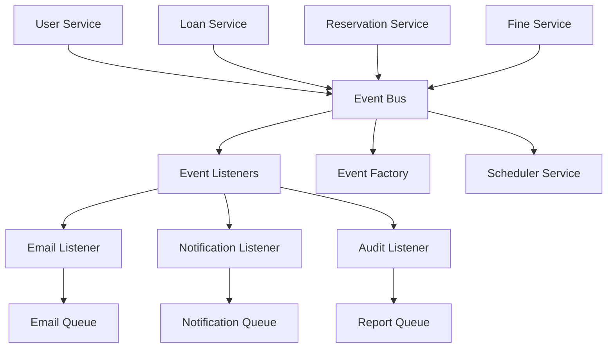

# 🎯 Arquitetura Orientada a Eventos - Biblioteca Universitária

## 📋 Visão Geral

A Biblioteca Universitária implementa uma **arquitetura orientada a eventos (Event-Driven Architecture)** que permite comunicação assíncrona entre módulos, processamento em background e melhor escalabilidade do sistema.

---

## 🏗️ Arquitetura

### **Componentes Principais**



### **Fluxo de Eventos**

1. **Publicação**: Serviços de domínio publicam eventos
2. **Processamento**: Event Bus distribui eventos para listeners
3. **Execução**: Listeners processam eventos assincronamente
4. **Integração**: Eventos são convertidos em jobs de fila

---

## 📦 Estrutura de Arquivos

```
src/events/
├── interfaces/                 # Interfaces de eventos
│   ├── base-event.interface.ts
│   ├── user-events.interface.ts
│   ├── loan-events.interface.ts
│   ├── reservation-events.interface.ts
│   ├── fine-events.interface.ts
│   ├── material-events.interface.ts
│   └── index.ts
├── decorators/                 # Decorators para eventos
│   ├── event-handler.decorator.ts
│   ├── publish-event.decorator.ts
│   └── index.ts
├── services/                   # Serviços de eventos
│   ├── event-bus.service.ts
│   ├── event-factory.service.ts
│   ├── loan-scheduler.service.ts
│   └── index.ts
├── listeners/                  # Event listeners
│   ├── email-event.listener.ts
│   ├── notification-event.listener.ts
│   ├── audit-event.listener.ts
│   └── index.ts
├── events.module.ts           # Módulo principal
└── index.ts                   # Exportações
```

---

## 🎭 Tipos de Eventos

### **1. Eventos de Domínio (Domain Events)**
Eventos que representam mudanças de estado em agregados de domínio.

```typescript
interface DomainEvent extends BaseEvent {
  aggregateId: string;
  aggregateVersion: number;
}
```

**Exemplos:**
- `user.created` - Usuário criado
- `loan.created` - Empréstimo criado
- `loan.returned` - Empréstimo devolvido
- `reservation.fulfilled` - Reserva atendida

### **2. Eventos de Integração (Integration Events)**
Eventos para comunicação entre bounded contexts.

```typescript
interface IntegrationEvent extends BaseEvent {
  destination?: string;
  priority: EventPriority;
}
```

### **3. Eventos de Sistema**
Eventos gerados por tarefas agendadas e processos automáticos.

**Exemplos:**
- `loan.expiring_soon` - Empréstimo vence em breve
- `loan.overdue` - Empréstimo em atraso
- `reservation.expired` - Reserva expirada

---

## 🔧 Implementação

### **1. Publicação de Eventos**

```typescript
// No serviço de usuários
async create(createUserDto: CreateUserDto): Promise<UserResponseDto> {
  const user = await this.prisma.user.create({
    data: userData
  });

  // Disparar evento
  const userCreatedEvent = this.eventFactory.createUserCreatedEvent(
    user.id,
    user.email,
    user.name,
    user.userType,
    user.active
  );
  
  await this.eventBus.publish(userCreatedEvent);

  return this.mapToResponseDto(user);
}
```

### **2. Event Listeners**

```typescript
@Injectable()
export class EmailEventListener {
  @OnEvent('user.created')
  async handleUserCreated(event: UserEvent) {
    if (event.eventType === 'user.created') {
      await this.queueService.addEmailJob({
        type: 'welcome',
        to: event.data.email,
        subject: 'Bem-vindo à Biblioteca Universitária',
        template: 'welcome',
        data: {
          name: event.data.name,
          userType: event.data.userType,
        },
      });
    }
  }
}
```

### **3. Tarefas Agendadas**

```typescript
@Injectable()
export class LoanSchedulerService {
  @Cron(CronExpression.EVERY_DAY_AT_9AM)
  async checkExpiringLoans() {
    // Verificar empréstimos que vencem em breve
    // Disparar eventos de notificação
  }
}
```

---

## 📊 Eventos Implementados

### **Módulo de Usuários**
- ✅ `user.created` - Usuário criado
- ✅ `user.updated` - Usuário atualizado
- ✅ `user.password_changed` - Senha alterada
- ✅ `user.login` - Login realizado
- ✅ `user.logout` - Logout realizado
- ✅ `user.deactivated` - Usuário desativado
- ✅ `user.activated` - Usuário ativado

### **Módulo de Empréstimos**
- ✅ `loan.created` - Empréstimo criado
- ✅ `loan.returned` - Empréstimo devolvido
- ✅ `loan.renewed` - Empréstimo renovado
- ✅ `loan.expiring_soon` - Empréstimo vence em breve
- ✅ `loan.overdue` - Empréstimo em atraso
- ✅ `loan.cancelled` - Empréstimo cancelado

### **Módulo de Reservas**
- ✅ `reservation.created` - Reserva criada
- ✅ `reservation.fulfilled` - Reserva atendida
- ✅ `reservation.cancelled` - Reserva cancelada
- ✅ `reservation.expired` - Reserva expirada
- ✅ `reservation.expiring_soon` - Reserva expira em breve
- ✅ `reservation.queue_updated` - Fila de reservas atualizada

### **Módulo de Multas**
- ✅ `fine.created` - Multa criada
- ✅ `fine.paid` - Multa paga
- ✅ `fine.overdue` - Multa em atraso
- ✅ `fine.cancelled` - Multa cancelada
- ✅ `fine.installment_created` - Parcelamento criado
- ✅ `fine.installment_paid` - Parcela paga

### **Módulo de Materiais**
- ✅ `material.created` - Material criado
- ✅ `material.updated` - Material atualizado
- ✅ `material.status_changed` - Status alterado
- ✅ `material.available` - Material disponível
- ✅ `material.unavailable` - Material indisponível
- ✅ `material.maintenance_required` - Manutenção necessária

---

## 🔄 Integração com Filas

### **Mapeamento de Eventos para Filas**

| Evento | Fila | Ação |
|--------|------|------|
| `user.created` | Email | Enviar email de boas-vindas |
| `loan.expiring_soon` | Notification | Notificar usuário |
| `loan.overdue` | Email + Notification | Email e notificação |
| `reservation.fulfilled` | Email + Notification | Notificar disponibilidade |
| `fine.created` | Email | Notificar multa |
| Todos os eventos | Report | Log de auditoria |

### **Processamento Assíncrono**

```typescript
// Event Listener converte evento em job de fila
@OnEvent('loan.expiring_soon')
async handleLoanExpiringSoon(event: LoanEvent) {
  await this.queueService.addNotificationJob({
    type: 'loan_reminder',
    userId: event.data.userId,
    title: 'Empréstimo vence em breve',
    message: `Seu empréstimo vence em ${event.data.daysUntilDue} dias.`,
    priority: 'high',
    data: event.data,
  });
}
```

---

## ⏰ Tarefas Agendadas

### **Cronograma de Execução**

| Tarefa | Horário | Descrição |
|--------|---------|-----------|
| `checkExpiringLoans` | 09:00 | Verifica empréstimos que vencem em 1-2 dias |
| `checkOverdueLoans` | 10:00 | Verifica empréstimos em atraso |
| `checkExpiringReservations` | 11:00 | Verifica reservas expirando em 1-2 dias |
| `checkExpiredReservations` | 12:00 | Processa reservas expiradas |

### **Configuração de Cron**

```typescript
@Cron(CronExpression.EVERY_DAY_AT_9AM)
async checkExpiringLoans() {
  // Implementação
}
```

---

## 🛠️ Configuração

### **EventEmitter2**

```typescript
EventEmitterModule.forRoot({
  wildcard: false,
  delimiter: '.',
  newListener: false,
  removeListener: false,
  maxListeners: 10,
  verboseMemoryLeak: false,
  ignoreErrors: false,
})
```

### **ScheduleModule**

```typescript
ScheduleModule.forRoot()
```

---

## 📈 Benefícios

### **1. Desacoplamento**
- Módulos não dependem diretamente uns dos outros
- Comunicação através de eventos assíncronos
- Facilita manutenção e testes

### **2. Escalabilidade**
- Processamento assíncrono de eventos
- Integração com sistema de filas
- Possibilidade de distribuição horizontal

### **3. Flexibilidade**
- Fácil adição de novos listeners
- Eventos podem ter múltiplos handlers
- Configuração dinâmica de processamento

### **4. Auditoria**
- Todos os eventos são logados
- Rastreabilidade completa de operações
- Histórico de mudanças de estado

### **5. Notificações Automáticas**
- Emails automáticos baseados em eventos
- Notificações em tempo real
- Lembretes e alertas programados

---

## 🚀 Uso Prático

### **Adicionando Novo Evento**

1. **Definir Interface**
```typescript
export interface NewEvent extends DomainEvent {
  eventType: 'new.event';
  data: {
    // dados específicos
  };
}
```

2. **Criar Factory Method**
```typescript
createNewEvent(data: any): DomainEvent {
  return this.createDomainEvent('new.event', data.id, 1, data);
}
```

3. **Publicar Evento**
```typescript
const event = this.eventFactory.createNewEvent(data);
await this.eventBus.publish(event);
```

4. **Criar Listener**
```typescript
@OnEvent('new.event')
async handleNewEvent(event: NewEvent) {
  // processar evento
}
```

---

## 🔍 Monitoramento

### **Logs de Eventos**

```typescript
// Event Bus Service
this.logger.log(`Event published: ${event.eventType} - ID: ${event.eventId}`);
this.logger.debug(`Handling event: ${eventType} (${event.eventId})`);
```

### **Estatísticas**

```typescript
getEventStats(): any {
  return {
    listeners: this.eventEmitter.listenerCount(),
    eventNames: this.eventEmitter.eventNames(),
  };
}
```

---

## 📚 Referências

- [NestJS Event Emitter](https://docs.nestjs.com/techniques/events)
- [NestJS Task Scheduling](https://docs.nestjs.com/techniques/task-scheduling)
- [Event-Driven Architecture Patterns](https://microservices.io/patterns/data/event-driven-architecture.html)
- [Domain Events Pattern](https://martinfowler.com/eaaDev/DomainEvent.html)
